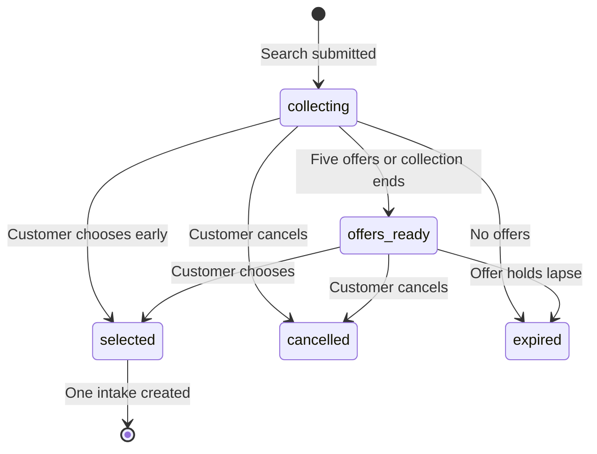
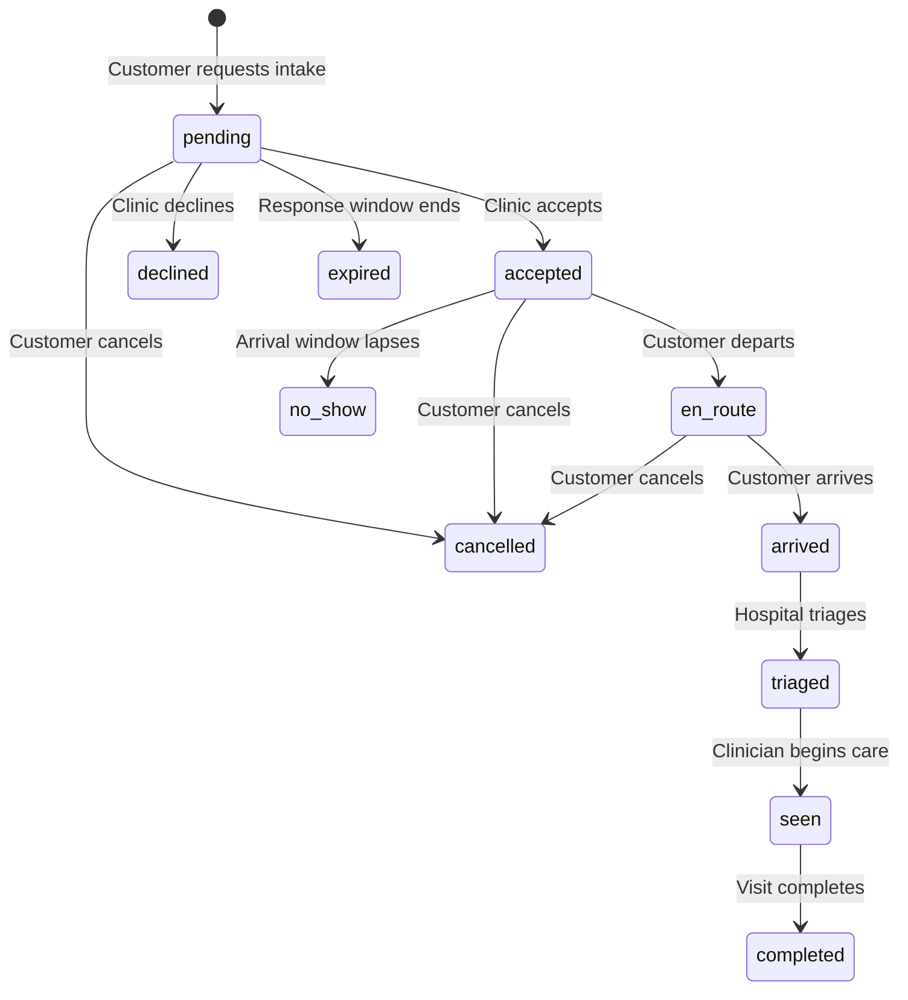

# Tími NOW MVP architecture

## Product boundary

Tími is not a veterinary appointment scheduler. Its primary transaction is a short-lived **intake request** asking a veterinary location to accept a specific pet now.

The public availability object includes:

- Intake status: available, limited, confirm first, critical only, diverting, closed, or unverified
- Stable-patient wait range
- Additional intake capacity
- Whether critical patients are being accepted
- Data source and confidence
- Reported and expiry timestamps

An expired hospital report is never silently treated as current. It becomes `unverified` with low confidence.

## Cloudflare topology

| Concern | Cloudflare component |
| --- | --- |
| PWA and static brand assets | Workers Static Assets |
| HTTP API and routing | Cloudflare Worker |
| Tenants, locations, status history, intakes, policies | D1 |
| Status and request expiration | Cron Trigger and scheduled Worker handler |
| Runtime telemetry | Workers Logs and observability |
| Secrets | Worker secrets |

The MVP deliberately avoids a PIMS dependency. The clinic console is the operational source for current capacity. Future connectors can write `availability_reports` with `source='integration'` without changing the customer contract.

## Multi-clinic offer search

A customer submits one `care_searches` record. Tími ranks as many as 30 matching participating locations and creates one tenant-isolated `care_search_targets` row for each clinic. A clinic does not book the customer when it responds; it creates a temporary `care_offers` record containing its availability type, arrival window, reported wait, deposit-policy snapshot, exam-fee information when supplied, instructions, and expiration time.

The customer may choose as soon as an offer arrives. Collection stops after 90 seconds or five active offers, whichever occurs first. Offers use a tenant-controlled hold of two to ten minutes, with five minutes as the baseline. The selection transaction conditionally locks `care_searches.selected_offer_id`, creates one accepted `intake_requests` row, marks the chosen offer and target selected, and releases every other target and offer. Conditional SQL prevents two simultaneous customer actions from confirming different clinics.

Emergency-intake offers describe current acceptance and an estimated wait only. They never promise examination priority because the hospital independently triages patients on arrival.

## Intake state machine

Every transition is recorded in `intake_events`. Clinic decisions use a conditional D1 update against `status='pending'`, preventing two team members from deciding the same request differently.

## Availability confidence

The MVP stores source and confidence explicitly rather than calculating a deceptive universal score.

| Source | Default interpretation |
| --- | --- |
| Hospital console update | High confidence until expiry |
| Integrated queue or PIMS | High confidence according to connector SLA |
| Successful Tími intake response | Medium confidence |
| Customer observation | Medium when recent and corroborated |
| Historical prediction | Low unless supported by current signals |

Critical patients are never ranked solely by shortest stable-patient wait. The customer interface states that the hospital performs clinical triage.

## Tenant isolation and Clerk

`SIGN_IN_REQUIRED` must equal the exact string `true` before authentication is enforced. When enabled:

1. The browser obtains the Clerk session token.
2. The Worker verifies its RS256 signature against Clerk JWKS with Web Crypto.
3. The active Clerk organization ID maps to `tenants.clerk_org_id`.
4. Clinic routes require an organization member/admin role and use the mapped tenant ID.
5. Customer mutations retain the Clerk user ID for ownership and auditability.

With the flag disabled, the customer experience is open and the clinic console uses explicit demo headers. This path is intended only for development and founding-clinic demonstrations.

## Payment boundary

Deposits are not requested until an intake is accepted. The intake retains a JSON snapshot of the exact active tenant policy so later policy edits cannot alter an existing customer agreement.

The Stripe path is:

1. Accepted intake requests a PaymentIntent.
2. Worker creates the PaymentIntent using its Stripe secret.
3. Browser confirms through Stripe Payment Element.
4. Worker retrieves the PaymentIntent before recording `paid`.

No-deposit tenants never receive payment fields. Demonstration mode simulates the provider response but uses the same database state.

## Safety boundaries

- Intake questions are routing inputs, not diagnosis.
- A deterministic red-flag term or checked warning elevates the request to emergency.
- Non-emergency facilities reject emergency-elevated submissions at the API boundary.
- Public wait values are ranges and explicitly described as stable-patient estimates.
- The nearest appropriate emergency facility is favored over a farther location with a shorter stable wait.
- Tími does not promise treatment order; hospital staff triage every arrival.

## Production checklist

1. Replace the placeholder D1 UUID and apply migrations.
2. Replace demonstration locations and phone numbers.
3. Configure Clerk organizations before enabling `SIGN_IN_REQUIRED`.
4. Configure Stripe secrets and turn off `DEMO_MODE`.
5. Add a notification delivery Worker or approved SMS/email provider to consume `notification_outbox`.
6. Obtain veterinary and legal review of red-flag wording, customer consent, deposits, refunds, and emergency routing.
7. Add Turnstile and rate-limit rules to public intake mutations before an unrestricted launch.
